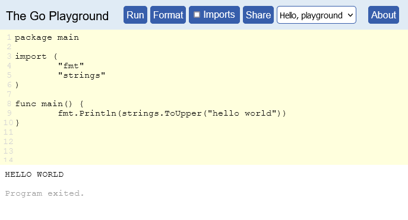

_This was an original piece I wrote for DAZN's internal blog earlier in the year, that I've adapted for a public audience._

In our team we recently created a small new API in Go, to provide editorial teams a more reliable search experience when curating content. In this post, I wanted to share some experiences from starting afresh with Go, through the lens of doing Node.js development.

I’m not advocating to take what you do in Node and take the same approach in Go, but to simply explain the concepts against something you already know and how they are different.

- You’ll get to read my opinions about:
    - Why Go?
    - Go vs Node: Building, linting and testing
    - Dealing with private modules
    - Learning materials
- I won’t be writing about
    - How to setup your dev environment
    - How to build your first http server, etc etc (lots of other blog posts and content are available online for this)

## Why Go?
The <a href="https://golang.org/AUTHORS" target="_blank">Go Authors</a> set out a set of values for the language:
- Thoughtful
- Simple
- Efficient
- Reliable
- Productive
- Friendly

Which I feel is a really human way to describe a technical topic like a programming language, and it also resonates throughout the Go community itself, and is documented in the <a href="https://golang.org/conduct" target="_blank">Code of Conduct</a>.

I love that Go is easy to read, has a tiny footprint (a SCRATCH Docker image is around 2mb, not far off the native binary) and can run almost anywhere: X86, ARM, MIPS, PPC, RISC-V, s390x, Web Assembly and there’s even a microcontroller version for the Arduino (TinyGo).

Go is really geared up for smaller applications, like CLI’s, microservices and API’s and it also has a great concurrency model if your application needs to do heavier crunching.

Here’s an example of Go’s simplicity, of how you can add a method to an existing float64 type in Go:
```go
type MyFloat float64
func (m MyFloat) Abs() float64 {
   f := float64(m)
   if f < 0 {
       return -f
   }
   return f
}
f := MyFloat(-42)
f.Abs() // == 42.0
```

Anyone who can write code, will be able to read this and see what it’s doing.

## Go vs Node
In this section I’ll be explaining Go workflow fundamentals through the lens of a Node.js developer.

### Building
Running and building code in Node.js and Go is simple:
```bash
# Run a node app:
node ./app.js

# Run a go app:
go run main.go

# or build a native binary
go build -o my-app main.go

# and execute it
./my-app
```

When you build a Go binary, the Go runtime (garbage collection, scheduler, etc) is bundled in to the executable – this means any consumers of your app do not require the Go runtime to be installed (unlike Java, .NET and even Node.js).


### Hot Restart
When developing your application, you may want to make small changes and see them immediately (for example, an API endpoint or changing HTML markup). In Node.js, you will have seen this kind of behaviour with `nodemon`, `jest --watch`, `webpack` etc.

Unfortunately for Go, this requires a full rebuild, as unlike script based languages, the executable code can’t just be ‘swapped’ out (like you would see with a hot reload).

Fortunately, Go does build quickly – and there are tools out there to give us hot restart behaviour. <a href="https://github.com/gravityblast/fresh" target="_blank">Fresh</a> is the one we have been using in our team, but <a href="https://github.com/cespare/reflex" target="_blank">Reflex</a> is another option.


### REPL
Node.js’s REPL (Read Eval Print Loop) is a great tool for trying out language features, inbuilt functions and other experimentation.
```bash
node 
Welcome to Node.js v15.11.0.
Type ".help" for more information.
> console.log('hello world'.toUpperCase())
HELLO WORLD
```

There’s not a Go equivalent, but there is <a href="https://play.golang.org/" target="_blank">The Go Playground</a> that has pretty much the same behaviour.



### Installing Packages

Introducing packages in Go is very similar to Node:
```bash
# node
npm install express --save

# go
go get -u github.com/gorilla/mux
```

Both commands will update the aforementioned package files, and you can then require/import the package and use it in your application.

Node: `package.json`
```json
{
  "name": "some-package",
  "version": "1.0.0",
  "description": "",
  "main": "index.js",
  "scripts": {
    "test": "echo \"Error: no test specified\" && exit 1"
  },
  "author": "",
  "license": "ISC",
  "dependencies": {
    "express": "^4.17.1"
  }
}
```

GO: `go.mod`
```
module github.com/privateorg/some-package
go 1.15
require github.com/gorilla/mux v1.8.0
```

Node: `package-lock.json`
```json
{
  "name": "some-package",
  "version": "1.0.0",
  "lockfileVersion": 1,
  "requires": true,
  "dependencies": {
    "accepts": {
      "version": "1.3.7",
      "resolved": "https://registry.npmjs.org/accepts/-/accepts-1.3.7.tgz",
      "integrity": "sha512-Il80Qs2WjYlJIBNzNkK6KYqlVMTbZLXgHx2oT0pU/fjRHyEp+PEfEPY0R3WCwAGVOtauxh1hOxNgIf5bv7dQpA==",
      "requires": {
        "mime-types": "~2.1.24",
...
```

Go: `go.sum`
```
github.com/gorilla/mux v1.8.0 h1:i40aqfkR1h2SlN9hojwV5ZA91wcXFOvkdNIeFDP5koI=
github.com/gorilla/mux v1.8.0/go.mod h1:DVbg23sWSpFRCP0SfiEN6jmj59UnW/n46BH5rLB71So=
```

They’re not exactly the same, but pretty similar.

### Scripts

npm scripts are a great way to run common commands for testing, linting, building, etc, they are a way of self documenting how to interact with the codebase, for example in `package.json` you could have:
```json
"scripts": {
   "build": "./build.sh",
   "dev:": "webpack-dev-server",
   "lint": "./scripts/lint.sh",
   "lint:fix": "./scripts/lint-fix.sh",
   "test": "npx jest",
},
```

then if you want to run the tests, just run `npm test`.

Go has some built in commands like `go test` or `go build`, but it doesn’t have an npm scripts equivalent. A typical 'go to' is `Make`; everyone has it installed already (but it can get ugly, quick, and you may fallback to shell scripts):
```makefile
build:
   go build -o my-app main.go
dev:
   fresh
lint:
   ./lint.sh
lint-fix:
   ./lint.sh --fix
test:
   go test ./...
```

but it does mean you can run common tasks simply, e.g. `make build` or `make test`.

### Linting
The Go compiler is pretty good at telling you off for certain things (e.g. importing a package that isn’t used). There’s also the `go fmt` command that will format your code nicely, and this even gets run automatically if you’re using Visual Studio Code.


However, if you’d like something more comprehensive, there are plenty of linting tools out there. The one we picked up in our team is <a href="http://golangci-lint.run" target="_blank">golangci-lint</a> as it has sensible defaults, easy to run (locally, Docker and even <a href="https://github.com/marketplace/actions/run-golangci-lint" target="_blank">GitHub Actions</a>).

### Testing
Let’s take a look at a HTTP GET request for some users:

```js
import axios from 'axios';

class Users {
    static all() {
        return axios.get('/users.json').then(resp => resp.data);
    }
}

export default Users;
```

if we want to test this in Node.js, we may mock the request library and return a canned response:
```js
import axios from 'axios';
import Users from './users';

jest.mock('axios');

test('should fetch users', () => {
    const users = [{name: 'Bob'}];
    const resp = {data: users};
    axios.get.mockResolvedValue(resp);
    return Users.all().then(data => expect(data).toEqual(users));
});
```

now let’s see what happens if we took the same approach in Go (using a request library called Resty):
```go
type Users []struct {
   Name string `json:"name"`
}

func all() Users {
   resp, _ := resty.New().R().
       SetResult(Users{}).
       Get("https://example.com/users.json")
   return (*resp.Result().(*Users))
}
```

In Go, we can’t mock the entire dependency at runtime. Go compiles to a native binary, so we can’t just swap out the loaded module at runtime like we do in Node.js.

We need a different approach.

Go has a testing framework built in, so strictly speaking we don’t need any external packages (though you may want to use a package like Testify to simplify boilerplates for spies, assertions, etc).

Let’s write a test:
```go
func Test_All_ShouldFetchUsers(t *testing.T) {
   expectedUsers := Users{{Name: "Timmy"}, {Name: "Dylan"}}
   actualUsers := all()
   if !reflect.DeepEqual(expectedUsers, actualUsers) {
       t.Errorf("Not the same, expected: %v, actual: %v", expectedUsers, actualUsers)
   }
}
```

Oh no, we just wrote a test that uses Resty to make a real HTTP request! If the data on the API changes, or the network is down – our tests will fail! They’ll also run slower than they should. This isn’t good.

What we should be doing, is depending on an interface instead – then we can inject any implementation we want.

Let’s rewrite our code:
```go
func main() {
   // client now created by consumer of all() 
   client := resty.New().R().
       SetResult(Users{})
   users := all(client)
}

type Users []struct {
   Name string `json:"name"`
}

type Client interface {
   // same signature as Resty's get method
   Get(url string) (*resty.Response, error)
}

// all now accepts the Client interface
func all(client Client) Users {
   resp, _ := client.
              Get("https://example.com/users.json")
   result := resp.Result()
   return (*result.(*Users))
}
```

- on lines 3-5, we create the Resty client and pass it in to `all()`
- on line 18, we accept an interface `Client` (defined in line 14) – it has the same signature as Resty’s `Get` function, thus Resty (a third party library) implements **OUR** interface – because interface implementation in Go is implicit
- on lines 19-20, we call the Get() function, just like we were before – but using the passed in client

and here’s how we could have written the test:
```go
type MockGetter struct {
   // Users internal to the mock
   mockUsers Users
}

// Method on our mock struct, but adhere's to Resty's Get() signature!
func (r *MockGetter) Get(url string) (*resty.Response, error) {
   // Creating our own Resty request, with mock users
   request := &resty.Request{Result: &r.mockUsers}
   return &resty.Response{Request: request}, nil
}

func Test_All_ShouldFetchUsers(t *testing.T) {
   expectedUsers := Users{{Name: "Timmy"}, {Name: "Dylan"}}
   mock := &MockGetter{mockUsers: expectedUsers}
   actualUsers := all(mock)
   if !reflect.DeepEqual(expectedUsers, actualUsers) {
       t.Errorf("Not the same, expected: %v, actual: %v", expectedUsers, actualUsers)
   }
}
```

- on line 15, we create an instance of the MockGetter (defined on line 1)
- because the `MockGetter` also implements the `Client` interface we defined (see `Get()` on line 7), we can simply pass in the mock to `all()` on line 17.

There are things we could further improve here, but I wanted to give an example close to the Node.js approach.

### Deployment
In a nutshell, the Go compiler produces a native binary for the platform of your choice. The runtime is bundled in to the binary – so you don’t need to worry about the target platform having your dependencies installed. For example, if you wanted to produce an ARM build for a Raspberry Pi, you target the ARM architecture and distribute the binary – simple!

This works great for CLI’s or API’s, and simple to run in Docker, AWS Lambda, etc too.

## Private Modules
Go uses Git over HTTPS by default (<a href="https://golang.org/doc/faq#git_https" target="_blank">documented here</a>) for safety (safe default and developer experience with corporate firewalls). However it can cause problems when you reference a private repo, with not the most clear error messages:
`go: github.com/myprivateorg/XYZ@v0.1.0: reading github.com/myprivateorg/XYZ/go.mod at revision v0.1.0: unknown revision v0.1.0`

There’s a couple of things you can do. For local development, you can force usage of SSH (and your private key) by modifying your Git configuration:

`git config --global url."git@github.com:".insteadOf "https://github.com/"`

Obviously for build pipelines this won’t work, and you may want to make use a token:
`git config --global --add url.https://${GITHUB_TOKEN}@github.com/.insteadOf "https://github.com"`

Where `${GITHUB_TOKEN}` is your GitHub token with ‘repo’ access. Obviously this will be slightly different if you use a different version control tool.

## Learning Materials
To finish off, here are some handy resources you can use:

- A Tour Of Go: <a href="https://tour.golang.org/" target="_blank">tour.golang.org</a> – goes through the language and key idioms
- Go Playground:<a href="https://play.golang.org/" target="_blank">play.golang.org</a> – like the Node.js REPL, but you can share snippets too
- <a href="http://changelog.com/gotime" target="_blank">Go Time Podcast</a> – Great panel show that is easy to listen to

That’s all, feel free to tweet me `@AdrianLThomas` with any comments.

Thanks for reading!