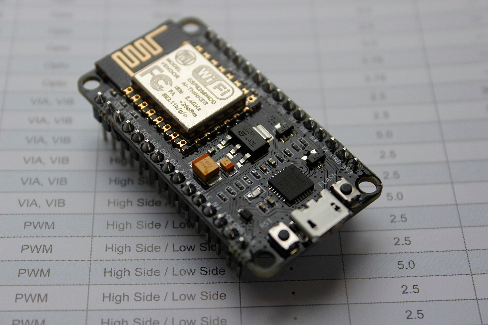
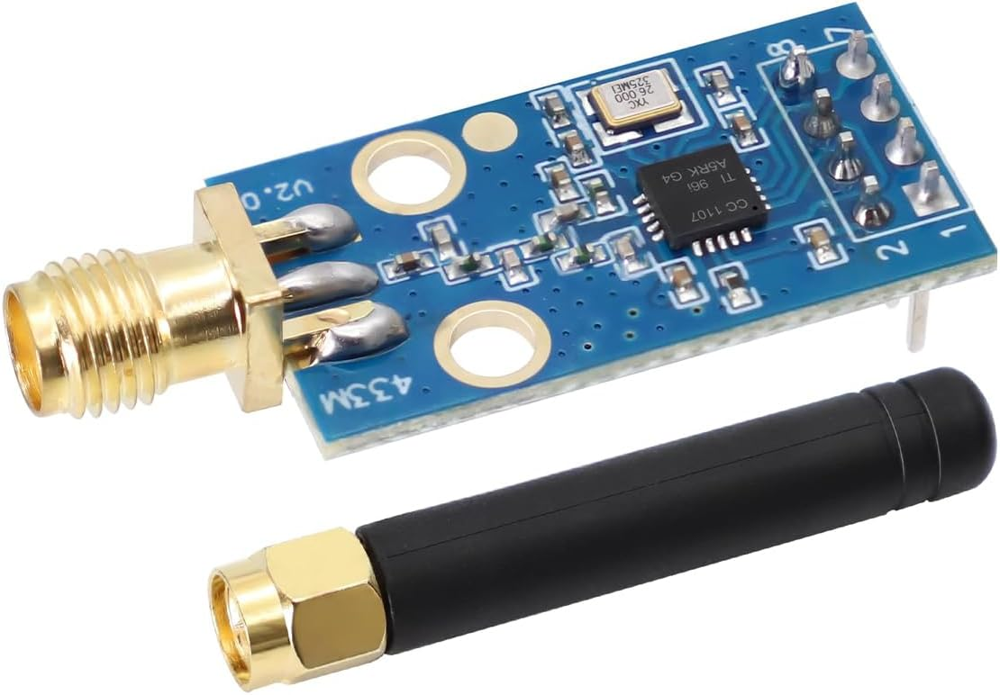
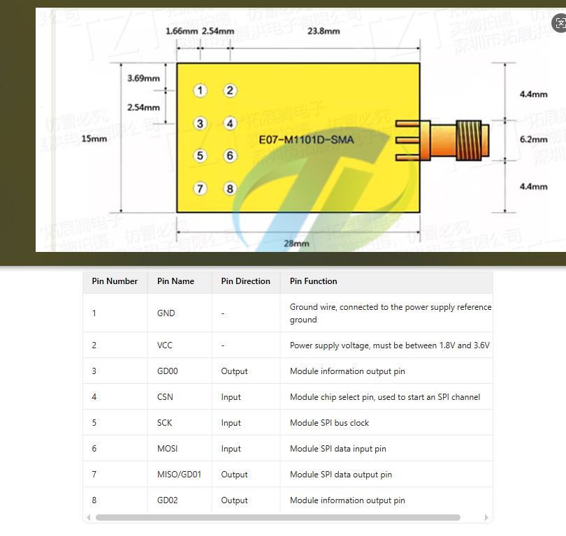
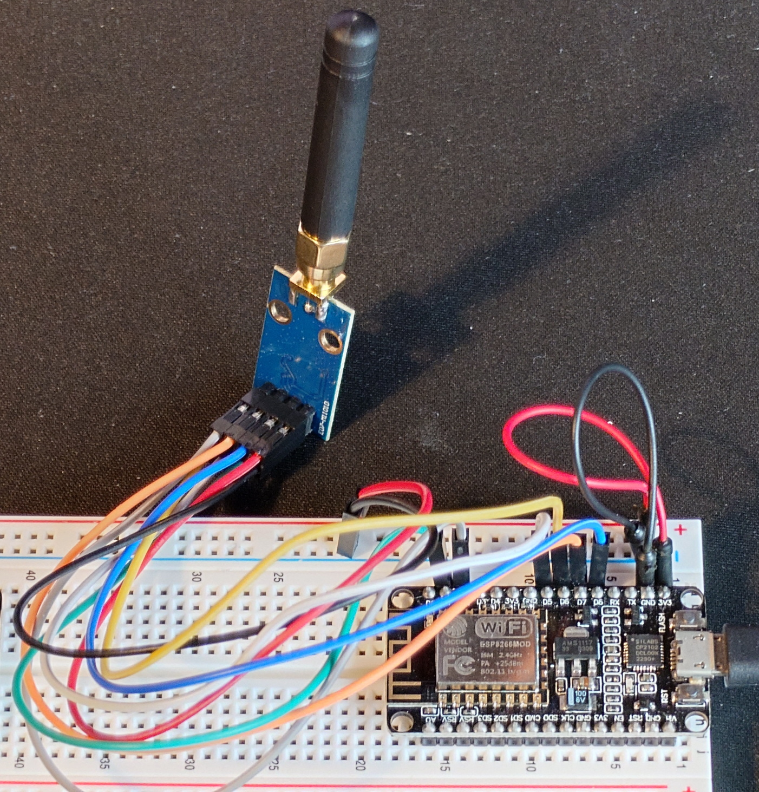

Water bills in the UK [are going up, again](https://www.bbc.co.uk/news/articles/c5yd9qzx79go), and I thought it would be a nice to keep a closer eye on the household usage by integrating the water meter in to [Home Assistant](https://www.home-assistant.io/).

# What I wanted to do
I wanted the data in Home Assistant so perhaps I could set up alerts and generally try to reduce how much water was being used (and identify when/where it gets used the most). 

## Setting up HA (Home Assistant)
I already had Home Assistant set up, but it's simple enough to get started if you're already self hosting things [with Docker](https://www.home-assistant.io/installation/linux#docker-compose) (e.g. homelab, raspberry pi or an off the shelf device). There's quite a [few options available](https://www.home-assistant.io/installation/).

# The Solution
The solution for you could well differ to mine, there's a ton of [options documented to read your water meter](https://www.home-assistant.io/docs/energy/water/), but in my case I had an Irton EverBlu Cyble water meter, that AFAIK is fairly common in the UK. So the first step would be identify what you have so that you can work out how to read it.

I came [across this post on the HA forum](https://community.home-assistant.io/t/reading-itron-everblu-cyble-rf-enhanced-water-meter-with-esp32-esp8266-and-433mhz-cc1101-home-assistant-mqtt-autodiscovery/833180) describing a solution for reading my meter using a 433MHz transceiver (the same way the water company reads the meter from the van outside your house).

I already had some spare ESP8266's around, so just needed a CC1101 transceiver which only cost a few quid off Amazon.

## ESP.. what?
The ESP8266 is a very cheap microcontroller (as in only a few pounds), with built in WiFi and Bluetooth.

They're not very powerful (80-160MHz), but the type of stuff you will be doing with them doesn't often require much power. If you've ever used at Arduino or used the SPI pins on a Raspberry Pi, you'll feel right at home.



## CC1.. what?
I didn't know much about the CC1101 until recently either. It's described as a low-cost sub-1 GHz transceiver designed for very low-power wireless applications.

Basically, you can use it to wirelessly read data from your meter.



## MQTT
[MQTT](https://mqtt.org/) is a lightweight message queue, commonly used for IoT. We can publish the state of the water meter to it, and Home Assistant will subscribe to these updates accordingly.

# Getting started
So if you want to follow along, I'm making the following assumptions:
1. You have the same water meter as me
1. You have Home Assistant set up and running
1. You have an ESP8266
1. You have a CC1101

# Wiring up the CC1101 to the ESP8266
When you buy a component like the CC1101 you normally get a pin out diagram, either from the manufacturer or you can find one online, that looks like this:


The code we're going to use provided this mapping table; so attach the CC1101 accordingly:

| **CC1101**  | **ESP8266** | **Notes**                                      |
|-------------|-------------|------------------------------------------------|
| VCC         | 3V3         | Connect to the 3.3V power pin.                 |
| GDO0        | D1          | General-purpose digital output.                |
| CSN         | D8          | SPI chip select; Feather has GPIO15 as CS.     |
| SCK         | D5          | SPI clock pin; SPI SCK maps to GPIO14.         |
| MOSI        | D7          | SPI MOSI pin; maps to GPIO13 on the Feather.   |
| GDO1 (MISO) | D6          | SPI MISO pin; maps to GPIO12 on the Feather.   |
| GDO2        | D2          | Another general-purpose digital output.        |
| GND         | G           | Connect to ground.                             |

_The original table can be found in the source repository `README.md`_

You should then end up with something like this:


# Problem 1: How do we compile this thing?
OK so going back to the original forum post, the code takes us to [this repository](https://github.com/genestealer/everblu-meters-esp8266-improved) that is a fork of some older code. I had some issues (documentation and code changes), so of course I forked the fork, and you can [find it here](https://github.com/AdrianLThomas/everblu-meters-esp8266-improved). This fork will remain the basis of what I refer to for the rest of the blog post.

_I raised a PR for the original maintainer, but at the time of writing it hasn't yet been merged._

Previously when tinkering with the ESP8266 I just used the Arduino IDE - it's fairly straightforward to get up and running. You write some C, compile, upload, and away you go. I'd also used [ESPHome](https://esphome.io/) which is a really nice declarative way to wire up components just using YAML.

However this project wasn't using either, but I did spot there was a `platformio.ini` file. That means this repo is a [PlatformIO](https://platformio.org/) project: effectively a VS Code extension to compile, debug, test and upload code to various IoT devices. It's new to me but looks pretty nice, and I look forward to trying it out more in the future.

_Setting up VSCode and PlatformIO is straightforward so I'll leave Google to handle that for you._

Finally, you need to configure some private variables as part of the build:
```c
/// Private.h
#define secret_wifi_ssid "your wifi ssid"
#define secret_wifi_password "your wifi password"

#define secret_mqtt_server "ip of your mqtt server"
#define secret_clientName "whatever unique client name you want to use"

#define secret_mqtt_username "your mqtt user" // or leave blank if not using
#define secret_mqtt_password "your mqtt pass" // or leave blank if not using

#define secret_local_timeclock_server "pool.ntp.org"

// Change these define according to your hardware

#define METER_YEAR 20 // last two digits (e.g. 2019 is 19)
#define METER_SERIAL 123456 // your 6 digit serial
#define FREQUENCY 433.700007 // you can test for this using the test code in everblu-meters-esp8266.cpp
#define GDO0 5 //header 11 
```

We've not set up MQTT yet, more on this soon - so just come back to this config file once you're ready.

# Problem 2: Finding the right frequency
OK so now we can compile the code, we need to find the correct frequency. I mentioned before the transceiver works on 433MHz, but you need to calibrate it to work on the EXACT frequency to be a little lower/higher against your meter.

I'll defer this step back to the [repo instructions](https://github.com/AdrianLThomas/everblu-meters-esp8266-improved?tab=readme-ov-file#frequency-adjustment), but effectively there are some debug statements that you can uncomment that will write out to the serial monitor. Once you've found the correct one you can update your configuration accordingly (as per the snippet in the previous section).

# Problem 3: Setting up MQTT
I'll also gloss over this step too, but for me this was just a simple case of adding another container to my Docker Compose setup. I used [Eclipse Mosquitto](https://hub.docker.com/_/eclipse-mosquitto):

```yaml
services:
  mosquitto:
    image: eclipse-mosquitto:latest
    container_name: mosquitto
    restart: unless-stopped
    ports:
      - "1883:1883"
    volumes:
      - /your-config-path/mosquitto/config:/mosquitto/config
      - /your-config-path/mosquitto/data:/mosquitto/data
      - /your-config-path/mosquitto/log:/mosquitto/log
```

# Problem 4: Device not being auto discovered in HA
see PR. was bad json schema. TODO

got everything wired up, but nothing showing in HA.

I could listen to the # topic, saw messages, but no devices.

turned on debugging mqtt and checked logs.... copy paste errors from chatgpt chat.

saw messages complaining about the json payload. fixed this up and viola.

# Result
screenshot of HA. TODO
picture of setup? maybe put this at the start? wires etc

code can be found here: TODO
my pr: https://github.com/genestealer/everblu-meters-esp8266-improved/pull/3


# Next
3d print a case to tidy it up and tidy up the solution. TODO

My plan for this is: get some examples on thingiverse, copy paste them in to tinkercard, stick it all together, hide it away in the pantry with the water meter.
