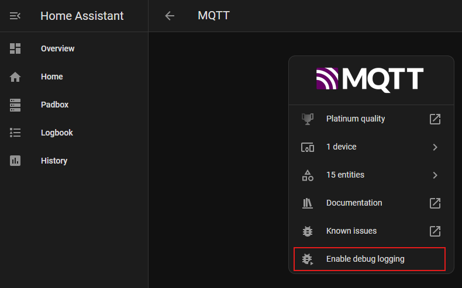
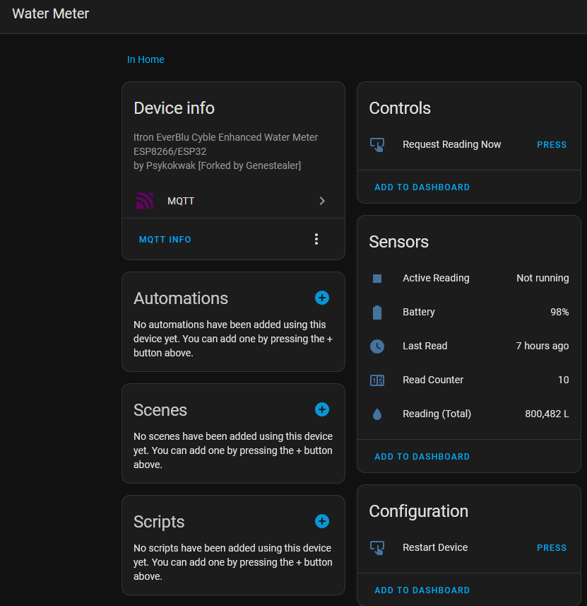

Water bills in the UK [are going up, again](https://www.bbc.co.uk/news/articles/c5yd9qzx79go), and I thought it would be nice to keep a closer eye on the household usage by integrating the water meter in to [Home Assistant](https://www.home-assistant.io/).

# What I wanted to do
I wanted the water meter readings in Home Assistant so perhaps I could set up alerts and generally try to reduce how much water was being used (and identify when/where it gets used the most). 

## Setting up HA (Home Assistant)
I already had Home Assistant set up, but it's simple enough to get started if you're already self hosting things [with Docker](https://www.home-assistant.io/installation/linux#docker-compose) (e.g. homelab, raspberry pi or an off the shelf device). There's quite a [few options available](https://www.home-assistant.io/installation/).

# The Solution
The solution for you could well differ from mine, there's a ton of [options documented to read your water meter](https://www.home-assistant.io/docs/energy/water/), but in my case I had an Irton EverBlu Cyble water meter, that as far as I know is fairly common in the UK. So the first step would be identify what you have so that you can work out how to read it.

I came [across this post on the HA forum](https://community.home-assistant.io/t/reading-itron-everblu-cyble-rf-enhanced-water-meter-with-esp32-esp8266-and-433mhz-cc1101-home-assistant-mqtt-autodiscovery/833180) describing a solution for reading my meter using a 433MHz transceiver (the same way the water company reads the meter from the van outside your house).

I already had some spare ESP8266's around, so just needed a CC1101 transceiver which only cost a few quid off Amazon.

## ESP.. what?
The ESP8266 is a very cheap microcontroller (as in only a few pounds), with built in WiFi.

They're not very powerful (80-160MHz), but for most IoT projects they don't need to be. If you've ever used an Arduino or used the SPI pins on a Raspberry Pi, you'll feel right at home.


## CC1.. what?
I didn't know much about the CC1101 until recently either. It's described as a low-cost sub-1 GHz transceiver designed for very low-power wireless applications.

Basically, you can use it to wirelessly read data from your meter.


## MQTT
We'll be using [MQTT](https://mqtt.org/) for this. It is a lightweight message queue, commonly used for IoT. We can publish the state of the water meter to it, and Home Assistant will subscribe to these updates accordingly.

# Getting started
So if you want to follow along, I'm making the following assumptions:
1. You have the same water meter as me
1. You have Home Assistant set up and running
1. You have an ESP8266
1. You have a CC1101

# Wiring up the CC1101 to the ESP8266
When you buy a component like the CC1101 you normally get a pin out diagram, either from the manufacturer or you can find one online, that looks something like this:


The code we're going to use provided this mapping table; so attach the CC1101 accordingly:

| **CC1101**  | **ESP8266** | **Notes**                                      |
|-------------|-------------|------------------------------------------------|
| VCC         | 3V3         | Connect to the 3.3V power pin.                 |
| GDO0        | D1          | General-purpose digital output.                |
| CSN         | D8          | SPI chip select; Feather has GPIO15 as CS.     |
| SCK         | D5          | SPI clock pin; SPI SCK maps to GPIO14.         |
| MOSI        | D7          | SPI MOSI pin; maps to GPIO13 on the Feather.   |
| GDO1 (MISO) | D6          | SPI MISO pin; maps to GPIO12 on the Feather.   |
| GDO2        | D2          | Another general-purpose digital output.        |
| GND         | G           | Connect to ground.                             |

_The original table can be found in the source repository `README.md`_

You should then end up with something like this:


# Problem 1: How do we compile this thing?
OK so going back to the original forum post, the code takes us to [this repository](https://github.com/genestealer/everblu-meters-esp8266-improved) that is a fork of some older code. I had some issues (documentation and code changes), so of course I forked the fork, and you can [find it here](https://github.com/AdrianLThomas/everblu-meters-esp8266-improved). This fork will remain the basis of what I refer to for the rest of the blog post.

_I raised a PR for the original maintainer, but at the time of writing it hasn't yet been merged._

Previously when tinkering with the ESP8266 I just used the Arduino IDE - it's fairly straightforward to get up and running. You write some C, compile, upload, and away you go. I'd also used [ESPHome](https://esphome.io/) which is a really nice declarative way to wire up components just using YAML.

However this project wasn't using either, but I did spot there was a `platformio.ini` file. That means this repo is a [PlatformIO](https://platformio.org/) project: effectively a VS Code extension to compile, debug, test and upload code to various IoT devices. It's new to me but looks pretty nice, and I look forward to trying it out more in the future.

_Setting up VSCode and PlatformIO are straightforward so I'll leave Google to handle that for you._

Finally, you need to configure some private variables as part of the build:
```c
/// Private.h
#define secret_wifi_ssid "your wifi ssid"
#define secret_wifi_password "your wifi password"

#define secret_mqtt_server "ip of your mqtt server"
#define secret_clientName "whatever unique client name you want to use"

#define secret_mqtt_username "your mqtt user" // or leave blank if not using
#define secret_mqtt_password "your mqtt pass" // or leave blank if not using

#define secret_local_timeclock_server "pool.ntp.org"

// Change these define according to your hardware

#define METER_YEAR 20 // last two digits (e.g. 2019 is 19)
#define METER_SERIAL 123456 // your 6 digit serial
#define FREQUENCY 433.700007 // you can test for this using the test code in everblu-meters-esp8266.cpp
#define GDO0 5 //header 11 
```

We've not set up MQTT yet. More on this below - just come back to this config file once you're ready.

# Problem 2: Finding the right frequency
OK so now we can compile the code, we need to find the correct frequency. I mentioned before the transceiver works on 433MHz, but you need to calibrate it to work on the EXACT frequency to be a little lower/higher against your meter.

I'll defer this step back to the [repo instructions](https://github.com/AdrianLThomas/everblu-meters-esp8266-improved?tab=readme-ov-file#frequency-adjustment), but effectively there are some debug statements that you can uncomment that will write out to the serial monitor. Once you've found the correct one you can update your configuration accordingly (as per the snippet in the previous section).

# Problem 3: Setting up MQTT
I'll also gloss over this step too, but for me this was just a simple case of adding another container to my Docker Compose setup. I used [Eclipse Mosquitto](https://hub.docker.com/_/eclipse-mosquitto):

```yaml
services:
  mosquitto:
    image: eclipse-mosquitto:latest
    container_name: mosquitto
    restart: unless-stopped
    ports:
      - "1883:1883"
    volumes:
      - /your-config-path/mosquitto/config:/mosquitto/config
      - /your-config-path/mosquitto/data:/mosquitto/data
      - /your-config-path/mosquitto/log:/mosquitto/log
```

# Problem 4: Device not being auto discovered in HA
The final issue I ran into was that the device was not being detected by HA.

1. When connecting to the serial monitor, the device was connecting to the meter OK and outputting the data
1. I could see that the ESP8266 had an IP address, so it must be connecting to the wifi fine
1. Viewing the Mosquitto container logs showed that messages were being received as expected from the esp8266
1. Manually subscribing to all topics (`#`) in HA showed that messages were being received correctly 

..yet no device appeared in HA

I enabled 'debug logging' for MQTT in HA:



and looked at the *system* logs. 

_💡 Tip: this is NOT the activity logbook, but the logs under Settings > System > Logs_

I could then see what the error was:
```
Logger: homeassistant.components.mqtt.entity
Source: components/mqtt/entity.py:155
integration: MQTT (documentation, issues)
First occurred: 02:11:02 (19 occurrences)
Last logged: 10:38:09

    Error 'extra keys not allowed @ data['device']['support_url']' when processing MQTT discovery message topic: 'homeassistant/sensor/water_meter_wifi_bssid/config', message: '{'unique_id': 'water_meter_wifi_bssid', 'object_id': 'water_meter_wifi_bssid', 'icon': 'mdi:access-point-network', 'qos': '0', 'state_topic': 'everblu/cyble/bssid', 'force_update': 'true', 'entity_category': 'diagnostic', 'device': {'identifiers': ['14071984'], 'model': 'Itron EverBlu Cyble Enhanced Water Meter ESP8266/ESP32', 'manufacturer': 'Psykokwak [Forked by Genestealer]', 'support_url': 'https://github.com/genestealer/everblu-meters-esp8266-improved', 'suggested_area': 'Home', 'name': 'Water Meter'}, 'name': 'WiFi BSSID'}'
    Error 'expected SensorDeviceClass or one of 'date', 'enum', 'timestamp', 'apparent_power', 'aqi', 'area', 'atmospheric_pressure', 'battery', 'blood_glucose_concentration', 'carbon_monoxide', 'carbon_dioxide', 'conductivity', 'current', 'data_rate', 'data_size', 'distance', 'duration', 'energy', 'energy_distance', 'energy_storage', 'frequency', 'gas', 'humidity', 'illuminance', 'irradiance', 'moisture', 'monetary', 'nitrogen_dioxide', 'nitrogen_monoxide', 'nitrous_oxide', 'ozone', 'ph', 'pm1', 'pm10', 'pm25', 'power_factor', 'power', 'precipitation', 'precipitation_intensity', 'pressure', 'reactive_power', 'signal_strength', 'sound_pressure', 'speed', 'sulphur_dioxide', 'temperature', 'volatile_organic_compounds', 'volatile_organic_compounds_parts', 'voltage', 'volume', 'volume_storage', 'volume_flow_rate', 'water', 'weight', 'wind_direction', 'wind_speed' for dictionary value @ data['device_class']' when processing MQTT discovery message topic: 'homeassistant/sensor/water_meter_wifi_status/config', message: '{'unique_id': 'water_meter_wifi_status', 'object_id': 'water_meter_wifi_status', 'device_class': 'connectivity', 'qos': '0', 'state_topic': 'everblu/cyble/status', 'force_update': 'true', 'entity_category': 'diagnostic', 'device': {'identifiers': ['14071984'], 'model': 'Itron EverBlu Cyble Enhanced Water Meter ESP8266/ESP32', 'manufacturer': 'Psykokwak [Forked by Genestealer]', 'support_url': 'https://github.com/genestealer/everblu-meters-esp8266-improved', 'suggested_area': 'Home', 'name': 'Water Meter'}, 'name': 'WiFi Status'}'
    Error 'extra keys not allowed @ data['device']['support_url']' when processing MQTT discovery message topic: 'homeassistant/sensor/water_meter_uptime/config', message: '{'unique_id': 'water_meter_uptime', 'object_id': 'water_meter_uptime', 'device_class': 'timestamp', 'qos': '0', 'state_topic': 'everblu/cyble/uptime', 'force_update': 'true', 'entity_category': 'diagnostic', 'device': {'identifiers': ['14071984'], 'model': 'Itron EverBlu Cyble Enhanced Water Meter ESP8266/ESP32', 'manufacturer': 'Psykokwak [Forked by Genestealer]', 'support_url': 'https://github.com/genestealer/everblu-meters-esp8266-improved', 'suggested_area': 'Home', 'name': 'Water Meter'}, 'name': 'Device Uptime'}'
    Error 'extra keys not allowed @ data['device']['support_url']' when processing MQTT discovery message topic: 'homeassistant/sensor/water_meter_wifi_signal_percentage/config', message: '{'unique_id': 'water_meter_wifi_signal_percentage', 'object_id': 'water_meter_wifi_signal_percentage', 'device_class': 'signal_strength', 'icon': 'mdi:wifi', 'unit_of_measurement': '%', 'qos': '0', 'state_topic': 'everblu/cyble/wifi_signal_percentage', 'force_update': 'true', 'entity_category': 'diagnostic', 'device': {'identifiers': ['14071984'], 'model': 'Itron EverBlu Cyble Enhanced Water Meter ESP8266/ESP32', 'manufacturer': 'Psykokwak [Forked by Genestealer]', 'support_url': 'https://github.com/genestealer/everblu-meters-esp8266-improved', 'suggested_area': 'Home', 'name': 'Water Meter'}, 'name': 'WiFi Signal'}'
    Error 'extra keys not allowed @ data['device']['support_url']' when processing MQTT discovery message topic: 'homeassistant/sensor/water_meter_value/config', message: '{'unique_id': 'water_meter_value', 'object_id': 'water_meter_value', 'icon': 'mdi:water', 'unit_of_measurement': 'L', 'device_class': 'water', 'state_class': 'total_increasing', 'qos': 0, 'state_topic': 'everblu/cyble/liters', 'force_update': True, 'device': {'identifiers': ['14071984'], 'model': 'Itron EverBlu Cyble Enhanced Water Meter ESP8266/ESP32', 'manufacturer': 'Psykokwak [Forked by Genestealer]', 'support_url': 'https://github.com/genestealer/everblu-meters-esp8266-improved', 'suggested_area': 'Home', 'name': 'Water Meter'}, 'name': 'Reading (Total)'}'
```

As you can see there are some errors regarding the `support_url` field. Removing this invalid field in the schema (and some other minor tweaks) in the PR resolved the issue and the device became available in HA! 🎉

# Result! What's next?


Now I just need to tidy up those wires and 3D print a tidy little case to hide it away in the pantry.

You can find my [fork here](https://github.com/AdrianLThomas/everblu-meters-esp8266-improved) or if you prefer to view the diff see the [PR to the maintainer here](https://github.com/genestealer/everblu-meters-esp8266-improved/pull/3).
